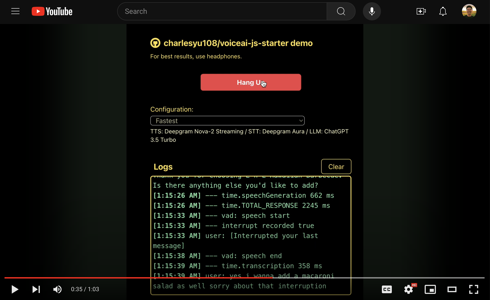

# Fullstack AI Voice Assistant Starter Project

### Demo Video
[](https://www.youtube.com/watch?v=Cc38Z536suc)

### Try it yourself
[https://voiceai-js-starter.vercel.app/](https://voiceai-js-starter.vercel.app/)

----------------------------------------------

This repo contains an end-to-end starter project for a web-based AI voice assistant.
I won't claim this project to be the fastest or most robust, but it's 100% free 
and open-source, so feel free to modify and use it as a base for your own projects. 

With fastest configurations, you can see assistant response times in ~1s TTFB (Time To First Byte)
after the user stops speaking.

If you have any questions or feedback, please feel free to open an issue.

## Features:
- Drop-in support for several popular TTS / STT providers including (OpenAI, Deepgram, ElevenLabs, PlayHT)
- Realtime audio streaming and playback via Websocket
- Low-latency browser-based Voice Audio Detection
- Interruptability
- Function calling support (by default assistatnt call ending is supported)

## Quick Start
Clone this repo.

### Start Web-app: 
```
cd web
npm install
npm run start
```
This will start the web-app on `localhost:3000`

### Start Server:
You will need to create a `.env` file with the following environment variables.
**With just an `OPENAI_API_KEY`, you can stand up a really powerful full-stack agent.**

```.env
OPENAI_API_KEY=<REQUIRED> # Required
ELEVEN_LABS_API_KEY=<OPTIONAL> # For use with ElevenLabs
DEEPGRAM_API_KEY=<OPTIONAL> # For use with Deepgram
PLAYHT_USER_ID=<OPTIONAL> # For use with PlayHT
PLAYHT_API_KEY=<OPTIONAL> # For use with PlayHT
```

```
cd server
npm install
npm run start
```
This will start the server on `localhost:8000`

## Your first configuration
The toy example configured in this project is a simple ordering assistant for L&L Hawaiian BBQ.
To create your own assistant, take a look at `server/index.starter.js` and follow the instructions.

